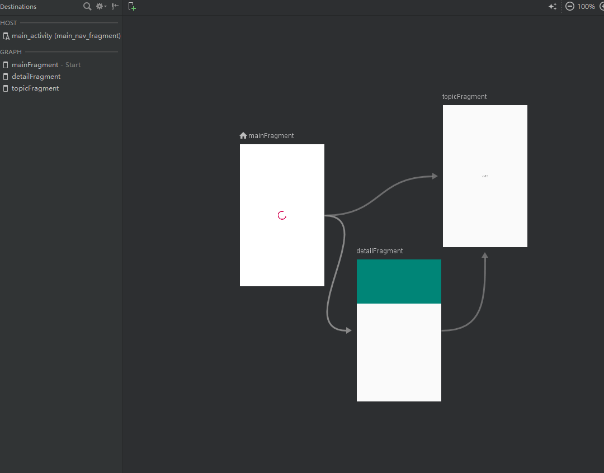

# AACDemo
Android Architecture Components Demo 

Android JetPack 组件使用样例

#### 更新日志 ####

***12.29 note***

* 添加paging依赖
* retrofit LivedataCallFactory

***11.07 note***
  
* 完善页面

***11.06 note***
  
* 引入`navigation`库，用于页面导航

***10.31 note***
  
* 用 `livedata`+`viewmodel`+`repository` 的结构，结合retrofit实现了一个简单页面
* 已测试使用 `work` 库，管理后台任务

***10.18 note***
  
* 最新的构建库 已迁移到 `androidx` 包下，老项目可使用 Studio-> Refactor -> Migrate to AndroidX 功能迁移
* 使用 [kapt](http://kotlinlang.org/docs/reference/kapt.html) 来支持 `Annotation Processor`

#### 工作流程 ####

#### NAVIGATION管理页面 ####

